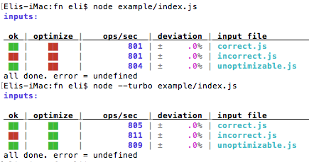

# @thrash/fn
[](https://travis-ci.org/elidoran/thrash-fn)
[](https://gemnasium.com/elidoran/thrash-fn)
[](http://badge.fury.io/js/%40thrash%2Ffn)
[](https://coveralls.io/github/elidoran/thrash-fn?branch=master)

Test validity, optimizability, and performance of functions.

Combines unit testing, performance benchmarking, and node (v8) optimization verification.

Supports both asynchronous and synchronous function calls.

Supports spawning child processes for each test.

See [@thrash/compare](https://www.npmjs.com/package/@thrash/compare) for applying this same concept for multiple implementations on multiple inputs. Basically, to compare performance of different implementations for the same inputs.


## Install

```sh
npm install --save-dev @thrash/fn
```


## Example Output

Prints:

1. the target directory containing the input files.
2. a table header for the column data for each input's results.

When all types are enabled the columns will be:

1. **ok** - whether the function produced the valid result for the input args. A green block means it validated and a red block means it didn't.
2. **optimized** - whether V8 was able to optimize the function for the input args. A green block means it validated and a red block means it didn't.
3. **ops/sec** - the rate the function was executed in "operations per second".
4. **standard deviation** - the amount the performance varied during performance testing.
5. **input file** - the name of the input file used for that row's results.



Note, [the example](example) is very simple to show the stuff instead of a "real" example. It's ops/sec is slow because it's using `setTimeout()` which has 1 millisecond as its smallest delay. Also, that makes its deviation super tiny so you see a zero in the results. Mostly, the example shows all the parts and the screenshot shows how the columns are printed.


## Usage

See the [test file](https://github.com/elidoran/thrash-fn/blob/master/test/index.js) for example calls of all styles.

The basic usage requires a path to the directory where the input files are stored and a function to call with the input information. Then, you put a bunch of "input files" in that directory which optionally provides the arguments to the function and the context.

Required thrash options:

1. **inputs** - a path to a directory containing "requireable" files which export an object with "input options" as described below.
2. **fn** - a function to "thrash". When setting the `spawn` option to true the `fn` property should be a path to a "requireable" file exporting the function to use. The spawned child process will "require" it.
3. **done** - a standard callback expecting `(error, result)`. (TODO: provide a cumulative results array to this final callback). This is called after the function has been run on all inputs.

Optional thrash options:

1. **async** - defaults to false. when true the function will receive a callback as its last arg and both the `beforeAll` and `afterAll` (optional) listeners will also receive callbacks.
2. **spawn** - defaults to false. when true each input will be tested, in series, in new child processes and the results output to the console and returned back to the parent process. This can help performance testing by using a new separate process for each performance run.
3. **validate** - defaults to true. When true any input with a `validate` function will be validated and its result included in the results. When false no validation will be performed and its column will not be shown in the printed results.
4. **checkOptimize** - defaults to true. When true the function's optimizability will be tested with each input. When false no optimization checks will be performed and its colunn will not be shown in the printed results.
5. **minTime** - Defaults to 1 minute. the minimum time spent in a performance run. Ensure this value is long enough to get a good test run, but, not so long it takes an annoyingly long time. :)
6. **minCount** - Defaults to 1,000. Minimum loop iterations during a performance run.
7. **interval** - Defaults to 1,000. This is how long a loop will run between doing stats calculations and, once reaching the minimums, it *could* consider stopping, but, doesn't yet (TODO).
8. **maxTime** - Defaults to 10 minutes. The maximum time allowed in a performance run. For a synchronous run, when it meets this maximum it stops immediately. For asynchronous, when an "interval" is reached it tests if the maximum time has been reached. The default of 10 minutes is a very long time. You'll likely want to set this to a shorter time.
9. **maxCount** - Defaults to 1 billion. The maximum loop iterations during a performance run. Same handling as above in **maxTime**. I used 1 billion because some stuff I performance test runs at approximately 50 million per second. That means it takes 20 seconds to hit 1 billion. So, I think 1 billion iterations, and 20 seconds, is likely long enough in a lot of cases. Play with different values to see how it affects your results.
10. **result** - a listener function called every time a performance run for an input is completed. The arguments are `(result, options)`. The `result` object contains all the stats and the `options` object is the options object provided to thrash.

The "input files" export an object with options. All options are optional. An empty object will use an empty args array and no context.

Input file options:

1. **args** - an array of arguments to pass to the function, or, a function which will return an array of args (in case they need to be built anew for every call)
2. **context** - an object, or a function which returns a new object, to use as a context when calling the function
3. **validate** - a function which accepts the result returned by the function and returns true or false specifying whether the result was valid.
4. **beforeAll** - a listener function called before a performance run begins on a function for a specific input. This is an asynchronous function with a callback as the second arg when the thrash option `async` is set to true; otherwise it's synchronous. Arguments are `(options, done)`.
5. **before** - a synchronous listener function called before the function is called, every time, during a performance run.
6. **after** - a synchronous listener function called after the function is called, every time, during a performance run.
7. **afterAll** - a listener function called after a performance run finished on a function for a specific input. This is an asynchronous function with a callback as the second arg when the thrash option `async` is set to true; otherwise it's synchronous. Arguments are `(options, done)`.

```javascript
// can require+call it at once.
require('@thrash/fn')({
  // required #1:
  inputs: 'path/to/directory/of/input/files',

  // required #2:
  // you will likely require a function from your library
  // to test.
  // it can be a class method. you supply the "context",
  // which is the class instance, from the input files.
  fn: require('./some/file.js'),

  // required #3:
  done: function(error, result) {
    // NOTE: `result` is not yet provided.
    // for each individual result add a `result` callback.
  }
})


// or, store it and use it repeatedly.
var thrash = require('@thrash/fn')

thrash({
  // ... options
})

thrash({
  // ... options
})

// all the options:
thrash({
  spawn: true,   // will spawn a child process for each input.
  async: true,   // runs function, beforeAll/afterAll with callback.
  minTime: 5,    // 5 seconds minimum performance run for an input.
  minCount: 1e6, // 1 million minimum performance iterations.
  interval: 1e3, // calculate stats every 1,000 iterations.
  maxTime: 10,   // 10 seconds maximum performance run for an input.
  maxCount: 1e9, // 1 billion maximum iterations for an input.
  validate: true, // use validate functions found in input files.
  checkOptimize: true, // check if function optimizes with each input.
  fn: function() {}, // the function to test...
  inputs: 'some/directory/with/input/files',
  result: function(result, options) {
    // called after each input performance run is complete.
  },
  done: function(error, result) {
    // called after all inputs have been tested.
    // NOTE: the cumulative `result` is not yet provided.
  }
})
```


## Results

The result for each input tested with the function has:

1. **elapsed** - the time, in seconds, spent running the function *only* during the performance run.
2. **count** - the number of times the function was called during the performance run.
3. **rate** - the ratio of operations per second for the entire performance run
4. **min** - the least time taken during a function call
5. **average** - the average time taken for all function calls
6. **max** - the longest time taken during a function call
7. **variance** - the statistical variance of time taken for all function calls (sum of the squares of the difference between the time taken and the average time take)
8. **deviation** - the statistical standard deviation of the time taken for all function calls (the square root of the variance)


## Uses: Enhanced Testing

Start thrashing all the functions you write to:

1. ensure they produce the correct results (so, testing is included in thrashing for free)
2. verify the functions are optimizable in node (V8 engine).
3. measure how different inputs affect the performance of the function.
4. measure performance to test if code changes affect performance significantly
5. or, compare performance between multiple implementations
6. run each performance test separately in its own new node instance using `spawn`.

If you're writing unit tests which provide an arguments array and a context for the function and then validate it produces the correct result, then you're already doing all the work necessary to use thrash. And, switching to thrash provides the above mentioned advantages.


# [MIT License](LICENSE)
